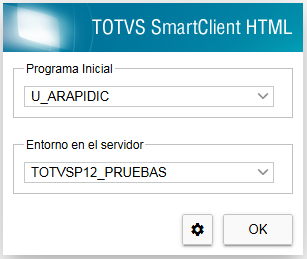

# ArApi

## Descripción

**ArApi** es un configurador de APIs REST dinámicas para **TOTVS Protheus**, desarrollado sobre **TLPP** y el **servidor REST nativo del AppServer**.

El objetivo del proyecto es permitir que un **analista funcional o programador** pueda **crear, modificar y mantener APIs REST completas sin necesidad de programar**, utilizando únicamente **tablas de configuración** dentro del ERP.

A través de estas tablas es posible definir:

* Endpoints REST
* Parámetros de entrada (`params`)
* Estructuras de datos (encabezado / detalle)
* Campos obligatorios según operación
* Respuestas de salida
* Descarga de archivos (PDF u otros)
* Autenticación OAuth2
* Documentación Swagger generada automáticamente

Todo el comportamiento de la API se define **por configuración**, no por código hardcodeado.

---

## Características principales

* APIs REST dinámicas basadas en tablas ZJx
* CRUD completo (GET / POST / PUT / DELETE)
* Validaciones automáticas de parámetros
* Autenticación OAuth2 con Bearer Token
* Swagger UI generado automáticamente
* Endpoints para descarga de archivos
* Compatible con TLPP / REST nativo de Protheus
* Sin dependencias externas

---

## Instalación

### 1. Compilación de fuentes

Se deben **compilar todos los fuentes del proyecto**.

Alternativamente, se puede **aplicar el patch** generado a partir de los fuentes de este repositorio.

---

### 2. Creación de tablas de configuración

Desde la **opción de programa inicial** del proyecto, ejecutar el programa U_ARAPIDIC que crea las tablas necesarias para el proceso:



* `ZJ1` – Definición de APIs
* `ZJ2` – Campos de encabezado (entrada)
* `ZJ3` – Campos de detalle 1
* `ZJ4` – Campos de detalle 2
* `ZJ5` – Campos de salida (GET)
* `ZJ6` – Parámetros de entrada (`params`)

Estas tablas constituyen el **núcleo del framework ArApi**.

---

### 2.1 Agregar el ABM de configuración al menú

Una vez compilado el proyecto y creadas las tablas, se debe agregar al menú la función:

* `U_ARAPI01`

Esta función es el **ABM de las configuraciones de ArApi** (alta/baja/modificación de APIs y sus campos). Se recomienda incorporarla dentro del **Configurador** (o menú de parametrización).

Después de agregarla al menú, configurar las APIs según corresponda.

---

## Diccionario de campos (tablas ZJx)

A continuación se describe el propósito de los campos más relevantes para la configuración. (Los detalles de estructura como `FILIAL`, `CODIGO` e `ITEM` dependen del índice/llave definida para cada tabla.)

### ZJ1 – Definición de la API

* **`ZJ1_CODIGO`**: Código único de API (ej: `apiClientes`).
* **`ZJ1_DESCRI`**: Descripción funcional.
* **`ZJ1_CODFUN`** (*Función*): nombre de la rutina Protheus que ArApi ejecutará vía `MSExecAuto` para **incluir/modificar/borrar** (ej: `MATA010`).
* **`ZJ1_EDATO`** (*Estructura de dato*):

  * `1` = Solo Encabezado (configurar ZJ2)
  * `2` = Encabezado + Detalle 1 (configurar ZJ2 y ZJ3)
  * `3` = Encabezado + Detalle 1 + Detalle 2 (configurar ZJ2, ZJ3 y ZJ4)
* **`ZJ1_SQL`** (*Consulta SQL*): query base usada para el GET (puede incluir placeholders/variables según la implementación del proyecto).
* **`ZJ1_TABLA`** (*Tabla principal*): tabla Protheus utilizada para validar existencia por clave única (ej: `SC5`).
* **`ZJ1_CLAVE`** (*Clave única*): concatenación de campos que componen la clave (separados por `+`). Ej: `C5_FILIAL+C5_NUM+C5_CLIENTE`.
* **`ZJ1_PATH`** (*Ruta archivo*): path relativo (desde el `RootPath` del ambiente) donde se buscarán archivos descargables. Ej: `\pdf\pedvta\`.
* **`ZJ1_FFILE`** (*Filename*): plantilla/expresión para construir el nombre de archivo (puede depender de `params`). ArApi lo utiliza junto a `ZJ1_PATH`.

  * Nota: el endpoint de archivo solo se documenta/expone cuando **`ZJ1_PATH` y `ZJ1_FFILE`** están informados.

### ZJ2 / ZJ3 / ZJ4 – Campos de entrada (encabezado / detalle)

> ZJ3 y ZJ4 repiten la misma lógica/estructura que ZJ2, aplicando a los detalles.

* **`ZJx_CAMPO`**: campo Protheus (SX3) al que mapea el dato.
* **`ZJx_CPOAPI`**: nombre del campo tal como viaja en la API (JSON).
* **`ZJx_OBLIG`**: obligatorio en **inclusión** (POST).
* **`ZJx_OBLIGM`**: obligatorio en **modificación** (PUT).
* **`ZJx_OBLIGB`**: obligatorio en **borrado** (DELETE).
* **`ZJx_VALID`**: expresión/función (macro) para validar el valor antes de ejecutar `MSExecAuto`.

  * Variables disponibles:

    * `__ARAPI_CAMPO` (campo Protheus)
    * `__ARAPI_CPOAPI` (campo API)
    * `__ARAPI_VAL` (valor)
* **`ZJx_MENSAJ`**: mensaje (macro) cuando `ZJx_VALID` devuelve `.F.`. Puede utilizar las variables anteriores.

### ZJ5 – Campos de salida (GET)

* **`ZJ5_CAMPO`**: nombre de campo devuelto por la consulta SQL (puede ser alias).
* **`ZJ5_CPOAPI`**: nombre del campo en la respuesta JSON.
* **`ZJ5_PICTUR`**: máscara/picture opcional para formateo.

### ZJ6 – Parámetros (`params`) para GET y FILE

* **`ZJ6_PARAM`**: nombre del parámetro esperado dentro de `params`.
* **`ZJ6_OBLIG`**: indica si el parámetro es obligatorio.

---

Estas tablas constituyen el **núcleo del framework ArApi**.

---

## 3. Configuración del AppServer (`appserver.ini`)

La siguiente configuración es **obligatoria** para que funcione el servicio REST nativo de TOTVS con TLPP.

```ini
[HTTPSERVER]
Enable=1
Log=0
Servers=HTTP_REST

[HTTP_REST]
hostname=localhost
port=9995
locations=HTTP_ROOT
ContentTypes=CT_HTTP
SslCertificate=C:\Totvs\App\P12-Onca\Appserver\totvs_certificate.crt
SslCertificateKey=C:\Totvs\App\P12-Onca\Appserver\totvs_certificate_key.pem
Charset=UTF-8
TlppData={"Authorization":{"scheme":"oAuth2","onAuth":"", "onAuthNoCheckUri":"u_ArApiNoCheckUri", "onAuthparams":"u_ArApiParamsProvider"}}

[HTTP_ROOT]
Path=/rest
RootPath=/web
DefaultPage=index.html
AllowMethods=GET, HEAD, POST, PUT, DELETE, PATCH, OPTIONS
ThreadPool=THREAD_POOL

[THREAD_POOL]
Environment=TOTVSP12_REST
MinThreads=1
MaxThreads=2
MinFreeThreads=1
GrowthFactor=1
InactiveTimeout=30000
AcceptTimeout=10000
```

### Importante

```ini
TlppData={"Authorization":{"scheme":"oAuth2","onAuth":"", "onAuthNoCheckUri":"u_ArApiNoCheckUri", "onAuthparams":"u_ArApiParamsProvider"}}
```

Las funciones:

* `u_ArApiNoCheckUri`
* `u_ArApiParamsProvider`

permiten que la **autenticación OAuth2 sea totalmente configurable**, evitando credenciales o tokens hardcodeados.

---

## 4. Archivos adicionales requeridos

Dentro de la estructura definida por `RootPath` del AppServer (por ejemplo `Protheus_Data`), crear la carpeta:

```
/arapi
```

### 4.1 Archivo `config.json`

```json
{
  "client": [
    {
      "client_id": "7LpPC0r3",
      "client_secret": "TlPp#S3cre7@"
    }
  ],
  "expires": [
    {
      "access_expires": 3600,
      "refresh_expires": "Date()+1"
    }
  ],
  "users": [
    {
      "username": "ademir_da_guia",
      "password": "F1t3bol"
    },
    {
      "username": "mark",
      "password": "Met@vers0"
    },
    {
      "username": "SebastiaoRodrigues",
      "password": "grand3Tim"
    }
  ],
  "types": [
    {
      "grant_type": "password"
    }
  ]
}
```

* Se pueden definir **múltiples usuarios**
* Los usuarios se utilizan para **obtener el token OAuth2**
* Los tiempos de expiración son configurables

---

### 4.2 Archivo `allowed_uris.lst`

Lista de endpoints que **NO requieren autenticación por token**:
En esta sección se podrán configurar todos los endpoints que se deseen.
Para una configuración inicial, al menos se deberán configurar los siguientes:

```
/arapi/{codigo_empresa}/{codigo_sucursal}/docs
/arapi/{codigo_empresa}/{codigo_sucursal}/openapi.json
```
Dónde:

* `codigo_empresa` Código de empresa segun el ambiente del cliente.
* `codigo_sucursal` Código de sucursal segun el ambiente del cliente.

---
*En caso de no agregarse estos endpoints, la documentación de Swagger no podrá funcionar correctamente.*

## 5. Autenticación OAuth2

### Endpoint de obtención de token

Para poder ejecutar cada uno de los endpoints a partir de la APIs configuradas, primero se deberá obtener el token.

```
https://{servidor}:{puerto}/{path_segun_ini}/tlpp/oauth2/token
```

Donde:
* `servidor`: Alias o Dominio del servidor según ambiente del cliente.
* `puerto`: Numero de puerto en donde se configuró el servicio API Rest.
* `path_segun_ini`: corresponde a:

```ini
[HTTP_ROOT]
Path=/rest
```
* `codigo_empresa`: Código de empresa según el ambiente del cliente.
* `codigo_sucursal`: Código de sucursal según el ambiente del cliente.

Parametros:
* `grant_type`: Valor fijo "password"
* `username`: Código de usuario según la configuracion establecida en config.json
* `password`: Contraseña para el usuario informado, según la configuracion establecida en config.json

Ejemplo:

```
https://localhost:9995/rest/tlpp/oauth2/token?grant_type=password&username=ademir_da_guia&password=F1t3bol
```

Una vez obtenido el token, el mismo debera enviarse para cada API configurada como:

```
Authorization: Bearer <token>
```

---

## 6. Swagger (Documentación de la API)

La documentación Swagger se genera automáticamente a partir de la configuraciones que se fueron cargando en las tablas ZJ1, ZJ2, ZJ3, ZJ4, ZJ5, ZJ6.
A partir del swagger, el usuario y/o desarrollador podra verificar los parametros de entrada y salida de cada endpoint configurado y verificar la forma en que deberán hacer las peticiones correspondientes.

### URL del Swagger

```
https://{servidor}:{puerto}/{path_segun_ini}/arapi/{codigo_empresa}/{codigo_sucursal}/docs
```

Donde 
* `servidor`: Alias o Dominio del servidor según ambiente del cliente.
* `puerto`: Numero de puerto en donde se configuro el servicio API Rest.
* `path_segun_ini`: corresponde a:

```ini
[HTTP_ROOT]
Path=/rest
```
* `codigo_empresa`: Código de empresa según el ambiente del cliente.
* `codigo_sucursal`: Código de sucursal según el ambiente del cliente.

Ejemplo:

```
https://localhost:9995/rest/arapi/99/01/docs
```


---

## Filosofía del proyecto

> **Menos código, más configuración.**

ArApi busca reducir tiempos de desarrollo, centralizar reglas de negocio y facilitar el mantenimiento de APIs REST en Protheus.

---

## Autor

**Andrés Demarziani**
